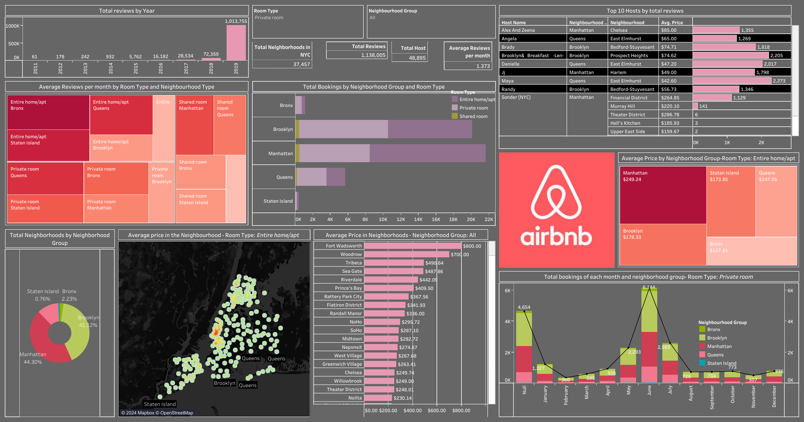

# NYC Airbnb Data Analysis and Machine Learning Modelling

This repository contains an extensive exploratory data analysis (EDA), machine learning (ML) modelling, and a Tableau dashboard visualization of Airbnb data in New York City. The project aims to provide insights into the Airbnb market, predict prices, and visualize key trends.

## Project Overview

### 1. Data Source
The dataset used in this project is from the NYC Airbnb Open Data. It includes various features like location, price, number of reviews, and other relevant attributes of Airbnb listings in New York City.

### 2. Exploratory Data Analysis (EDA)
The EDA section involves:
- Cleaning and preprocessing the data.
- Performing univariate and bivariate analysis.
- Identifying trends and patterns in the data.
- Visualizing important features using Python libraries such as pandas, matplotlib, and seaborn.

### 3. Machine Learning Modelling
In this section, we develop models to predict Airbnb prices. The steps include:
- Feature engineering and selection.
- Splitting the data into training and testing sets.
- Building and evaluating various regression models:
  - **Linear Regression Models**: Implemented using both `statsmodels` and `scikit-learn` to compare performance and interpretability.
  - **Random Forest**: Used for its ability to handle non-linear relationships and interactions between features.
- Hyperparameter tuning to optimize model performance.
- Model evaluation using metrics like RMSE, MAE, and R².

### 4. Tableau Dashboard
A comprehensive Tableau dashboard has been created to visualize:
- Distribution of listings across NYC boroughs.
- Average prices by neighborhood.
- Trends over time.
- Other key insights derived from the data.





Here's the link to the interactive dashboard [here](https://public.tableau.com/shared/FS4WG52D5?:display_count=n&:origin=viz_share_link).

The Tableau dashboard allows users to interact with the visualizations for deeper insights.

## Getting Started
To get a local copy up and running, follow these steps:

### Prerequisites
- Python 3.7+
- Jupyter Notebook
- Tableau

### Installation
1. Clone the repo:
    ```bash
    git clone https://github.com/yourusername/nyc-airbnb-analysis.git
    ```
2. Navigate to the project directory:
    ```bash
    cd nyc-airbnb-analysis
    ```
3. Install required Python packages:
    ```bash
    pip install -r requirements.txt
    ```

